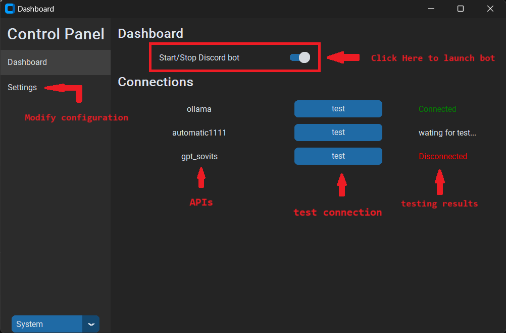

# Getting Started
## Prerequisites
- (Required) Python 3.10.6 (tested) [download here](https://www.python.org/downloads/release/python-3106/)
- (Required) Ollama api [GitHub](https://github.com/ollama/ollama)
- (Optional) GPT-SoVITS api_v3 [GitHub](https://github.com/RVC-Boss/GPT-SoVITS/tree/fast_inference_)

## Installation
1. Download zip or clone this repo
    ```sh
    git clone https://github.com/eric050828/DiscordAIChatBot.git
    ```
2. Click `setup.bat` or run this command
    1. Virtual environment
        ```sh
        python -m venv venv
        venv\Scripts\activate
        ```
    2. Install dependencies
        ```sh
        pip install -r requirements.txt
        ```
3. Create `.env`
```env
TOKEN = "your-discord-bot-token"
```


# Usage
- Click `run.bat` to launch Discord bot directly
- Click `run_gui.bat` to open GUI controll panel


## Update
- Click `update.bat` or pull remote repo
```sh
git remote add origin https://github.com/eric050828/DiscordAIChatBot.git
git pull
```